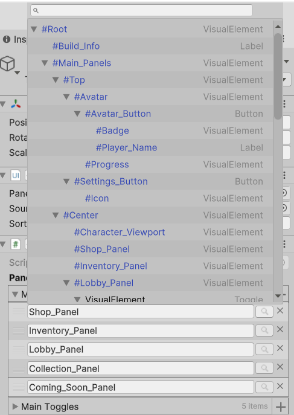
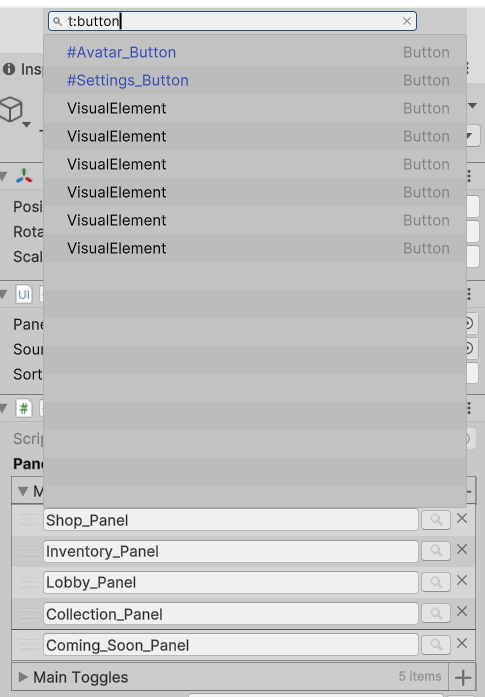

# Visual Element Picker

## Overview
This simple package streamlines the assignment of visual element references in MonoBehaviours. Using the attribute, you can quickly pick your visual elements associated with the UI document directly in the script object.

## Installation

### Method 1: Manual Installation
1. Clone or download this repository.
2. Open your Unity project.
3. Drag and drop the package into your `Assets` folder or `Packages` folder.

### Method 2: Unity Package Manager
1. Open the Unity Package Manager (Window -> Package Manager).
2. Click on the "+" button in the top left corner.
3. Select "Add package from git URL..."
4. Paste the following URL: `https://github.com/TitanX101/VisualElementPicker.git`
5. Click "Add" to install the package directly from the repository.

## Features
- Apply the `VisualElementPicker` attribute for `string` types and specify if you want to skip null elements (i.e., visual elements without names).
- From the picker, you can apply search filters either by name or by type directly. To search by type, use the same format as in Unity, for example, "t: MyVisualElementType".




## Usage Examples
Here are some examples of how to use the `VisualElementPicker` attribute:
```csharp
[VisualElementPicker]
public string myElement;

[VisualElementPicker(TargetType = typeof(MyVisualElementType))]
public string myTypedElement;

[VisualElementPicker(targetType: typeof(Button), skipEmpty: true)]
public string myFilteredElement;

[VisualElementPicker(true)]
public string myElementSkippingEmpty;```

## TODO
Although I'm not sure if this is possible yet, it would be interesting to be able to assign visual element references and ensure they don't get lost once their names are changed from the UI Builder. So this will be a POSSIBLE task to do.
